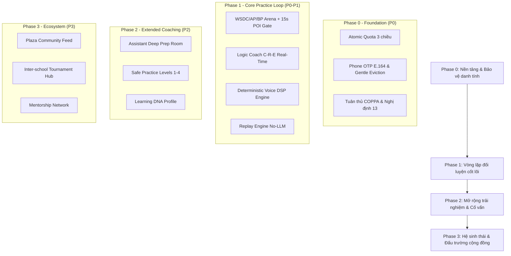

# 00_MASTER_SPEC — TỔNG QUAN KIẾN TRÚC HỆ THỐNG
> **Source of Truth:** Master Blueprint V15.0 (`ai-debate-master-blueprint-v15.pdf`)
> **Trạng thái:** 🟢 PRODUCTION-ALIGNED / HARDENED
> **Phiên bản:** 15.0.0 (Cập nhật ngày 20/08/2026)
> **Phạm vi:** Core Practice Loop & Thinking OS Architecture

---

## 1. Định Vị Dự Án
AI Debate Master là một **Hệ Điều Hành Tư Duy (Thinking OS)** và **Đấu Trường Đối Luyện AI (AI Cognitive Sparring)** dành cho học sinh, sinh viên và người rèn luyện kỹ năng tranh biện/tư duy phản biện.

Hệ thống cung cấp môi trường luyện tập tranh biện theo chuẩn quốc tế (WSDC, AP, BP), chẩn đoán lập luận thời gian thực theo mô hình C-R-E (Claim - Reasoning - Evidence), nhận diện ngụy biện và phân tích âm học giọng nói (DSP) với độ trễ thấp và chi phí tối ưu.

---

## 2. Thứ Tự Ưu Tiên Triển Khai (V15 Phased Strategy)

- **Phase 0 (Nền tảng & Ổn định):** Quota 3 chiều linh hoạt (Text / Voice / Assistant), Bảo mật dữ liệu học sinh (Parental Consent, COPPA / NĐ 13/2023/NĐ-CP), Single Session Heartbeat & Gentle Eviction, Tối ưu Prompt Contract.
- **Phase 1 (Vòng lặp cốt lõi - Core Practice Loop):** Text/Voice Arena, Chẩn đoán C-R-E Real-Time, Replay Engine No-LLM, Bộ đếm POI 15s & Vùng an toàn (Protected Time).
- **Phase 2 (Mở rộng trải nghiệm):** Safe Practice Levels 1-4, Assistant Deep Prep Room, Learning DNA Profile.
- **Phase 3 (Hệ sinh thái & Cộng đồng):** Plaza Open Match (Lightweight MVP), Tournament Hub, Mentorship Network.

---

## 3. Nguyên Tắc Thiết Kế Bất Biến (Architectural Invariants)

1. **Zero Waste LLM Rule:** Không sử dụng LLM cho các tác vụ deterministic (đếm số từ, tính WPM, phát hiện khoảng lặng, đếm từ đệm, render biểu đồ, phát lại Replay).
2. **Strict Single Identity:** Mỗi số điện thoại E.164 là 1 tài khoản duy nhất. 1 phiên hoạt động (Single Active Session) — đăng nhập mới tự động gentle-evict phiên cũ với mã `SESSION_REPLACED`.
3. **Atomic Quota Protection:** Mọi thao tác trừ lượt văn bản, giây thoại, câu hỏi trợ lý đều được bảo vệ bằng giao dịch nguyên tử (Row-level Locking) với nguyên tắc Fail-Closed.
4. **Pedagogical Safety Gate:** Giữ vững cấu trúc tranh biện chuẩn WSDC (1 phút đầu và 1 phút cuối là thời gian an toàn; POI floor giới hạn tối đa 15 giây).
5. **No AI Voice Cloning:** Loại bỏ hoàn toàn tính năng clone giọng để triệt tiêu rủi ro an toàn sinh trắc học và tuân thủ tuyệt đối chuẩn bảo vệ trẻ vị thành niên.
