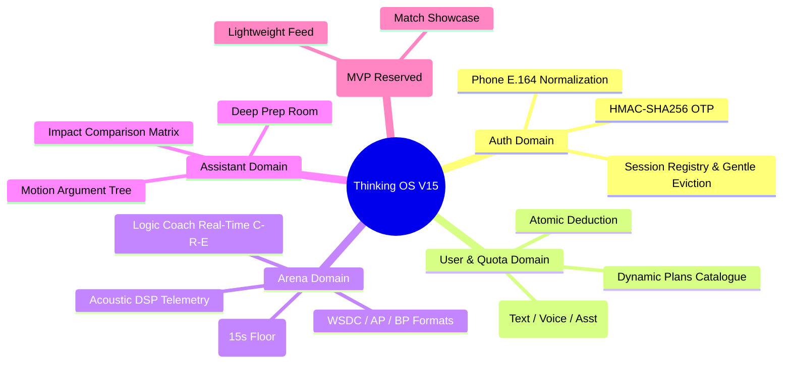

# 02_DOMAIN_SPEC — ĐẶC TẢ CÁC MIỀN NGHIỆP VỤ CỐT LÕI (5 CORE DOMAINS)
> **Source of Truth:** Master Blueprint V15.0 (`ai-debate-master-blueprint-v15.pdf`)
> **Trạng thái:** 🟢 PRODUCTION-ALIGNED / HARDENED
> **Phiên bản:** 15.0.0 (Cập nhật ngày 20/08/2026)
> **Phạm vi:** Core Practice Loop & Thinking OS Architecture

---

## 1. Danh Mục 5 Core Domains

---

## 2. Chi Tiết Từng Domain Nghiệp Vụ

### 2.1. Auth Domain (Xác thực & Danh tính)
- **Chuẩn hóa số điện thoại:** E.164 (`+84xxxxxxxxx` hoặc tương đương).
- **Mã OTP:** Sinh 6 chữ số ngẫu nhiên, mã hóa HMAC-SHA256 với secret nội bộ, thời gian sống (TTL) 3 phút, chống brute-force (giới hạn tối đa 5 lần thử).
- **Session Control:** Duy trì 1 phiên duy nhất per user_id. Tự động trục xuất phiên cũ nhẹ nhàng (`SESSION_REPLACED`).

### 2.2. User & Quota Domain (Hạn ngạch & Thương mại động)
- **Hạn ngạch 3 chiều:** `textTurnsRemaining`, `voiceMinsRemaining`, `assistantRemaining`.
- **Giao dịch nguyên tử:** Khấu trừ hạn ngạch trước khi xử lý AI turn, hoàn trả nếu AI pipeline thất bại (Fail-Closed).
- **Cấu hình động:** Danh mục gói cước (`PLAN_BASIC_49K`, `PLAN_STD_129K`, `PLAN_PRO_399K`) nạp trực tiếp từ cơ sở dữ liệu `SubscriptionPlan`.

### 2.3. Arena Domain (Đấu trường Đối luyện AI)
- **Bộ luật tranh biện:** WSDC (World Schools), AP (Asian Parliamentary), BP (British Parliamentary).
- **Luật POI (Point of Information):** Khóa POI trong phút đầu và phút cuối bài nói (Protected Time). Giới hạn thời gian chất vấn tối đa 15 giây.
- **Phản biện & Cố vấn kép:** Opponent đưa ra luận điểm đối kháng; Logic Coach phân tích độc lập C-R-E (Claim, Reasoning, Evidence), nhận diện ngụy biện và đưa ra khuyến nghị cải thiện.

### 2.4. Assistant Domain (Phòng Cố vấn Sâu)
- Phân tích kiến nghị đa chiều (Stakeholder Matrix, Policy vs Value Debate).
- Tạo dàn ý mở rộng và kịch bản phản biện giả định.

### 2.5. Plaza Domain (Cộng đồng & Trưng bày - MVP Lightweight / Spec Reserved)
- Trưng bày các trận đấu mẫu xuất sắc.
- Đánh dấu ở trạng thái *Lightweight MVP / Reserved for Phase 3*.