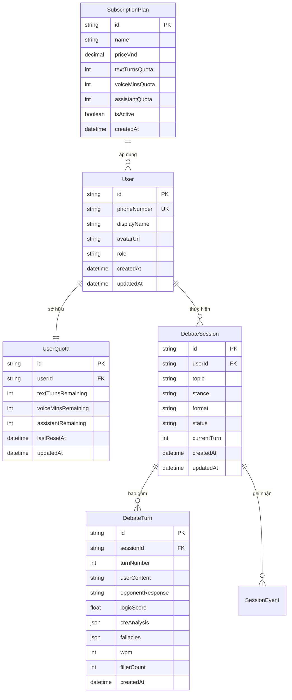

# 03_DATABASE_SPEC — THIẾT KẾ CƠ SỞ DỮ LIỆU & SCHEMA PRISMA
> **Source of Truth:** Master Blueprint V15.0 (`ai-debate-master-blueprint-v15.pdf`)
> **Trạng thái:** 🟢 PRODUCTION-ALIGNED / HARDENED
> **Phiên bản:** 15.0.0 (Cập nhật ngày 20/08/2026)
> **Phạm vi:** Core Practice Loop & Thinking OS Architecture

---

## 1. Mô Hình Thực Thể - Quan Hệ (ERD v15.0.0)



---

## 2. Bảng Cấu Hình Thương Mại Động (`subscription_plans`)

Mọi thông số gói cước được cấu hình độc lập trong bảng `subscription_plans`:

| Cột | Kiểu dữ liệu | Ràng buộc | Mô tả |
| :--- | :--- | :--- | :--- |
| `id` | `VARCHAR(64)` | `PRIMARY KEY` | Mã định danh (`PLAN_BASIC_49K`, `PLAN_STD_129K`, `PLAN_PRO_399K`) |
| `name` | `VARCHAR(128)` | `NOT NULL` | Tên hiển thị của gói |
| `price_vnd` | `DECIMAL(12,2)` | `NOT NULL` | Giá niêm yết tính bằng VNĐ |
| `text_turns_quota` | `INTEGER` | `NOT NULL` | Hạn ngạch lượt văn bản |
| `voice_mins_quota` | `INTEGER` | `NOT NULL` | Hạn ngạch phút thoại |
| `assistant_quota` | `INTEGER` | `NOT NULL` | Hạn ngạch lượt cố vấn |
| `is_active` | `BOOLEAN` | `DEFAULT TRUE` | Trạng thái mở bán |
| `created_at` | `TIMESTAMP` | `DEFAULT NOW()` | Thời điểm tạo bản ghi |

---

## 3. Ràng Buộc Hạn Ngạch 3 Chiều (`user_quotas`)

Bảng `user_quotas` quản lý số dư độc lập và hỗ trợ giao dịch trừ nguyên tử:

```sql
CREATE TABLE user_quotas (
    id VARCHAR(36) PRIMARY KEY DEFAULT gen_random_uuid(),
    user_id VARCHAR(36) UNIQUE NOT NULL REFERENCES users(id) ON DELETE CASCADE,
    text_turns_remaining INTEGER NOT NULL DEFAULT 20,
    voice_mins_remaining INTEGER NOT NULL DEFAULT 15,
    assistant_remaining INTEGER NOT NULL DEFAULT 10,
    last_reset_at TIMESTAMP WITH TIME ZONE DEFAULT NOW(),
    updated_at TIMESTAMP WITH TIME ZONE DEFAULT NOW()
);
```

---

## 4. Đặc Tả Bảng Tương Tác Plaza (`debate_session_likes`, `debate_session_favorites`, `debate_sessions.view_count`)
> **Phê duyệt:** Database Schema Authority Amendment (21/08/2026)
> **Mục tiêu:** Cung cấp hạ tầng persistence bền vững cho Plaza Phase 1 (Zero in-memory fallback, true DB atomicity).

### 4.1. Bảng `debate_session_likes` (Lượt thích bài đấu)
Đảm bảo tính nguyên tử và chống trùng lặp Like ở cấp độ cơ sở dữ liệu:
```sql
CREATE TABLE debate_session_likes (
    id UUID PRIMARY KEY DEFAULT gen_random_uuid(),
    session_id UUID NOT NULL REFERENCES debate_sessions(id) ON DELETE CASCADE,
    user_id UUID NOT NULL REFERENCES users(id) ON DELETE CASCADE,
    created_at TIMESTAMP WITH TIME ZONE DEFAULT NOW(),
    CONSTRAINT uq_session_user_like UNIQUE(session_id, user_id)
);
CREATE INDEX idx_debate_session_likes_session ON debate_session_likes(session_id);
CREATE INDEX idx_debate_session_likes_user ON debate_session_likes(user_id);
```

### 4.2. Bảng `debate_session_favorites` (Bookmark học tập cá nhân)
Đảm bảo bookmark cá nhân duy nhất cho từng người dùng per session:
```sql
CREATE TABLE debate_session_favorites (
    id UUID PRIMARY KEY DEFAULT gen_random_uuid(),
    session_id UUID NOT NULL REFERENCES debate_sessions(id) ON DELETE CASCADE,
    user_id UUID NOT NULL REFERENCES users(id) ON DELETE CASCADE,
    created_at TIMESTAMP WITH TIME ZONE DEFAULT NOW(),
    CONSTRAINT uq_session_user_favorite UNIQUE(session_id, user_id)
);
CREATE INDEX idx_debate_session_favorites_session ON debate_session_favorites(session_id);
CREATE INDEX idx_debate_session_favorites_user ON debate_session_favorites(user_id);
```

### 4.3. Cột `view_count` trên `debate_sessions`
Ghi nhận số lượt xem bài đấu, cập nhật nguyên tử bằng DB increment:
```sql
ALTER TABLE debate_sessions ADD COLUMN IF NOT EXISTS view_count INTEGER NOT NULL DEFAULT 0;
```
* **Nguyên tắc Invariant:**
  - `like_count = COUNT(debate_session_likes WHERE session_id = ...)`
  - `view_count = debate_sessions.view_count` (Atomic increment: `UPDATE debate_sessions SET view_count = view_count + 1 WHERE id = ...`)
  - `is_liked = EXISTS(debate_session_likes WHERE session_id = ... AND user_id = currentUser)`
  - `is_favorited = EXISTS(debate_session_favorites WHERE session_id = ... AND user_id = currentUser)`