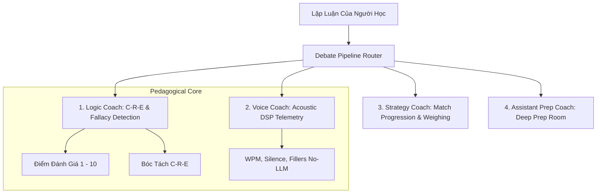

# 05_AI_COACH_SPEC — ĐẶC TẢ HỆ THỐNG 4 AI COACH & LOGIC ENGINE
> **Source of Truth:** Master Blueprint V15.0 (`ai-debate-master-blueprint-v15.pdf`)
> **Trạng thái:** 🟢 PRODUCTION-ALIGNED / HARDENED
> **Phiên bản:** 15.0.0 (Cập nhật ngày 20/08/2026)
> **Phạm vi:** Core Practice Loop & Thinking OS Architecture

---

## 1. Khung 4 AI Coach & Phân Vai Nhiệm Vụ

---

## 2. Logic Coach (C-R-E Analysis Engine)

Logic Coach chịu trách nhiệm chính trong việc đánh giá tính hợp lệ và cấu trúc của từng phát biểu:

1. **Claim (Luận điểm):** Đánh giá mức độ rõ ràng, tính khẳng định và liên quan trực tiếp đến kiến nghị.
2. **Reasoning (Lập luận):** Đánh giá logic nhân quả (Cause-and-Effect), tính liên kết giữa tiền đề và kết luận.
3. **Evidence (Dẫn chứng):** Đánh giá số liệu, nghiên cứu, ví dụ thực tế hoặc lập luận tương đương hỗ trợ.

---

## 3. Voice Coach (Định Hướng DSP-First)

- **Nguyên tắc No-LLM Telemetry:** Việc đếm số từ, tính tốc độ WPM (Words Per Minute), phát hiện khoảng lặng (Pauses) và đếm các từ đệm (`ừm`, `à`, `thì`, `kiểu như`, `như là`) được xử lý hoàn toàn bằng Engine DSP phía Client/Backend và truyền vào Prompt dưới dạng số liệu đã tính sẵn.
- **Tiết kiệm Token:** LLM chỉ đưa ra nhận xét sư phạm dựa trên telemetry đã cung cấp, không tiêu tốn token vào việc bóc tách hay đếm thủ công.