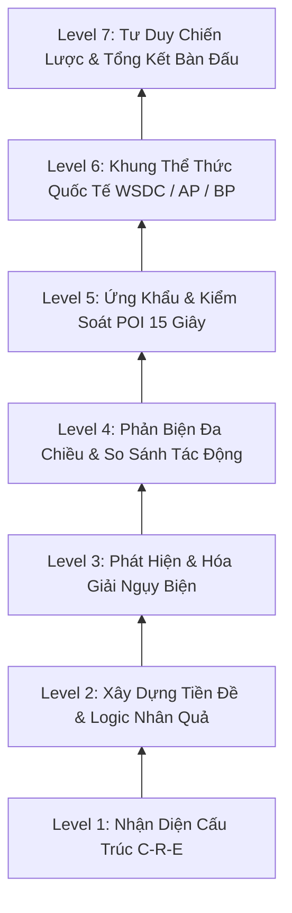

# 06_SKILL_TREE_SPEC — CÂY KỸ NĂNG TƯ DUY 7 CẤP BẬC & SAFE PRACTICE
> **Source of Truth:** Master Blueprint V15.0 (`ai-debate-master-blueprint-v15.pdf`)
> **Trạng thái:** 🟢 PRODUCTION-ALIGNED / HARDENED
> **Phiên bản:** 15.0.0 (Cập nhật ngày 20/08/2026)
> **Phạm vi:** Core Practice Loop & Thinking OS Architecture

---

## 1. Cây Kỹ Năng Tư Duy 7 Cấp Bậc (Cognitive Mastery Ladder)

---

## 2. Chu Trình Luyện Tập An Toàn (Safe Practice Levels 1-4)

Nhằm đảm bảo tâm lý thoải mái và tránh quá tải nhận thức cho học viên mới bắt đầu:

- **Level 1 (Guided Arena):** AI Opponent phản biện nhẹ nhàng, gợi ý câu trả lời mẫu, hỗ trợ hoàn thiện cấu trúc C-R-E.
- **Level 2 (Structured Sparring):** Tăng tốc độ tranh luận, yêu cầu đưa ra dẫn chứng cụ thể cho từng tiền đề.
- **Level 3 (Fallacy Challenge):** AI Opponent chủ động đưa ra các bẫy ngụy biện phổ biến để học viên phát hiện và bẻ gãy.
- **Level 4 (Championship Arena):** Áp dụng toàn bộ quy chuẩn bấm giờ WSDC, thời gian an toàn (Protected Time) và chất vấn POI 15 giây không giới hạn chủ đề.