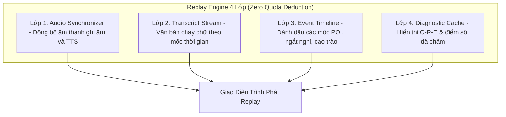

# 09_REPLAY_SPEC — ĐẶC TẢ REPLAY ENGINE 4 LỚP (STRICTLY NO-LLM)
> **Source of Truth:** Master Blueprint V15.0 (`ai-debate-master-blueprint-v15.pdf`)
> **Trạng thái:** 🟢 PRODUCTION-ALIGNED / HARDENED
> **Phiên bản:** 15.0.0 (Cập nhật ngày 20/08/2026)
> **Phạm vi:** Core Practice Loop & Thinking OS Architecture

---

## 1. Kiến Trúc Replay Engine 4 Lớp

Hệ thống Replay cho phép người học xem lại toàn bộ diễn biến trận đấu mà **không tốn bất kỳ chi phí gọi LLM nào** bằng cách tái hiện dữ liệu đã lưu trong Database:



---

## 2. Cấu Trúc Dữ Liệu Replay Packet

```json
{
  "sessionId": "deb_sess_178720",
  "topic": "Trí tuệ nhân tạo sẽ thay thế giáo viên trong tương lai",
  "format": "WSDC",
  "totalDurationSec": 480,
  "timeline": [
    {
      "timestamp": 65,
      "eventType": "POI_OFFERED",
      "speaker": "AI_OPPONENT",
      "durationSec": 15
    },
    {
      "timestamp": 120,
      "eventType": "TURN_COMPLETE",
      "turnNumber": 1,
      "logicScore": 8.2,
      "audioUrl": "/storage/audio/turn_1.webm"
    }
  ]
}
```