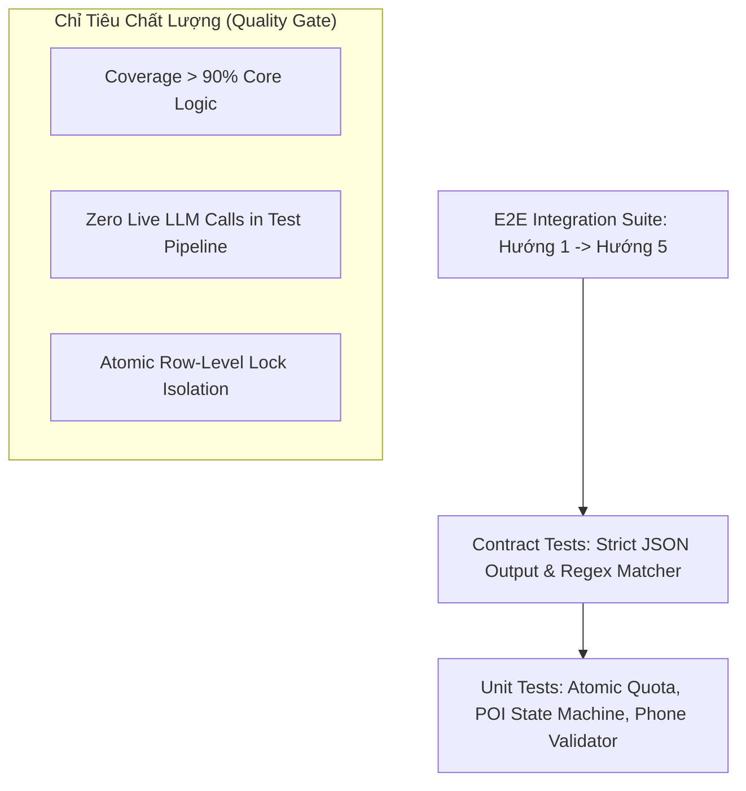

# 12_TESTING_SPEC — CHIẾN LƯỢC KIỂM THỬ TỰ ĐỘNG & E2E TEST SUITE
> **Source of Truth:** Master Blueprint V15.0 (`ai-debate-master-blueprint-v15.pdf`)
> **Trạng thái:** 🟢 PRODUCTION-ALIGNED / HARDENED
> **Phiên bản:** 15.0.0 (Cập nhật ngày 20/08/2026)
> **Phạm vi:** Core Practice Loop & Thinking OS Architecture

---

## 1. Tháp Kiểm Thử Tự Động (Testing Pyramid v15.0.0)

---

## 2. Các Kịch Bản Kiểm Thử Trọng Yếu (Critical Test Cases)

### 2.1. Quota Atomic Isolation Test (Hướng 1)
- **Mục tiêu:** Đảm bảo khi gửi đồng thời 10 requests từ cùng 1 user, số dư hạn ngạch không bị âm và giao dịch bị khóa tuần tự (Row-level Lock).
- **Nguyên tắc Fail-closed:** Nếu server gặp sự cố giữa chừng, giao dịch tự rollback, không trừ oan số dư người dùng.

### 2.2. POI Safety Gate Test (Hướng 5)
- **Protected Time:** Gửi yêu cầu POI tại giây thứ 30 và giây thứ 450 ➔ Kết quả bắt buộc bị từ chối (`PROTECTED_TIME_LOCKED`).
- **POI Floor 15s:** Bắt đầu POI tại giây 120 ➔ Tự động hết giờ và chuyển lại quyền nói cho diễn giả chính sau đúng 15 giây.

### 2.3. Voice DSP Deterministic Test (Hướng 4)
- Kiểm thử độ chính xác của bộ đếm từ đệm tiếng Việt (chính xác 100% với danh sách fixture chuẩn).
- Đo WPM chuẩn xác theo công thức: $\text{WPM} = \frac{\text{Word Count}}{\text{Duration in Minutes}}$.