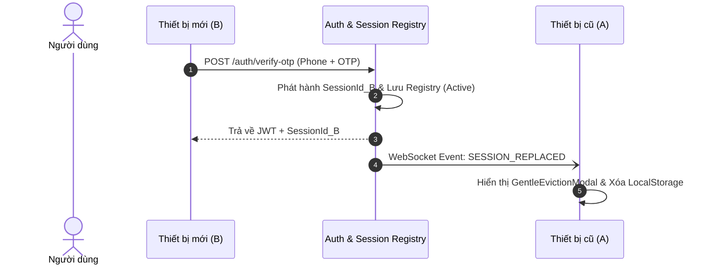

# 16_AUTHENTICATION_EXTENSION_SPEC — XÁC THỰC MỞ RỘNG & QUẢN LÝ PHIÊN
> **Source of Truth:** Master Blueprint V15.0 (`ai-debate-master-blueprint-v15.pdf`)
> **Trạng thái:** 🟢 PRODUCTION-ALIGNED / HARDENED
> **Phiên bản:** 15.0.0 (Cập nhật ngày 20/08/2026)
> **Phạm vi:** Core Practice Loop & Thinking OS Architecture

---

## 1. Đơn Giản Hóa Cơ Chế Quản Lý Phiên (Session Heartbeat & Soft Replacement)

Nhằm tối ưu trải nghiệm người dùng trong giai đoạn đầu và giảm thiểu rào cản kỹ thuật từ WebAuthn/Passkey phức tạp:
- **Chuẩn xác thực chính:** Số điện thoại E.164 + SMS OTP 6 chữ số (HMAC-SHA256).
- **Cơ chế Single Active Session:** Mỗi tài khoản duy trì duy nhất 1 phiên hoạt động.

---

## 2. Session Heartbeat & Graceful Revocation

- **Heartbeat:** WebSocket gửi ping/pong định kỳ 30 giây để xác nhận trạng thái kết nối còn sống.
- **Graceful Revocation:** Khi token bị thu hồi hoặc phiên bị thay thế, Backend trả về HTTP `401 Unauthorized` kèm header `X-Eviction-Reason: SESSION_REPLACED`. Axios interceptor phía frontend tự động điều hướng về màn hình đăng nhập an toàn.