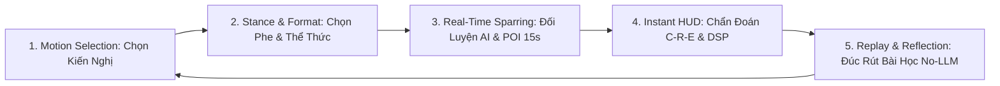

# 17_LEARNING_LOOP_SPEC — VÒNG LẶP HỌC TẬP TƯ DUY 5 BƯỚC (5-STAGE COGNITIVE LOOP)
> **Source of Truth:** Master Blueprint V15.0 (`ai-debate-master-blueprint-v15.pdf`)
> **Trạng thái:** 🟢 PRODUCTION-ALIGNED / HARDENED
> **Phiên bản:** 15.0.0 (Cập nhật ngày 20/08/2026)
> **Phạm vi:** Core Practice Loop & Thinking OS Architecture

---

## 1. Chu Trình Học Tập 5 Bước Khép Kín

---

## 2. Chi Tiết Từng Bước Trong Vòng Lặp

1. **Motion Selection (Chọn kiến nghị):** Hệ thống cung cấp ngân hàng kiến nghị phân theo chủ đề (Giáo dục, Công nghệ, Xã hội, Đạo đức, Môi trường).
2. **Stance & Format (Định vị):** Chọn phe Ủng hộ (Government) hoặc Phản đối (Opposition); chọn thể thức WSDC, AP, hoặc BP.
3. **Real-Time Sparring (Đối luyện):** Thực hiện phát biểu bằng văn bản hoặc giọng nói. Tận dụng POI 15 giây ngoài vùng thời gian an toàn (Protected Time).
4. **Instant HUD Feedback (Phản hồi tức thời):** Nhận phân tích tức thì về điểm số C-R-E, ngụy biện phát hiện, WPM và từ đệm.
5. **Replay & Reflection (Đúc rút):** Xem lại toàn bộ băng ghi âm đồng bộ văn bản, lưu lại các luận điểm xuất sắc vào Sổ tay tư duy cá nhân.
