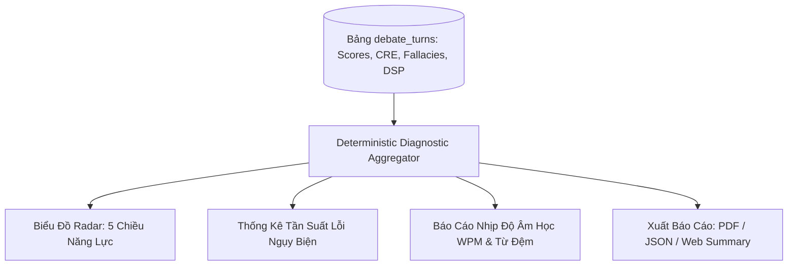

# 18_POST_MATCH_DIAGNOSTIC_SPEC — CHẨN ĐOÁN CHUYÊN SÂU SAU TRẬN ĐẤU (NO-LLM REPORTING)
> **Source of Truth:** Master Blueprint V15.0 (`ai-debate-master-blueprint-v15.pdf`)
> **Trạng thái:** 🟢 PRODUCTION-ALIGNED / HARDENED
> **Phiên bản:** 15.0.0 (Cập nhật ngày 20/08/2026)
> **Phạm vi:** Core Practice Loop & Thinking OS Architecture

---

## 1. Nguyên Tắc Tổng Hợp Báo Cáo Không Tốn Chi Phí LLM (Zero-LLM Overhead)

Sau khi hoàn thành trận đấu, hệ thống tự động tổng hợp báo cáo chẩn đoán từ toàn bộ dữ liệu C-R-E và telemetry đã tính toán trong từng lượt mà **không thực hiện thêm bất kỳ lượt gọi LLM tốn kém nào**:



---

## 2. Cấu Trúc Báo Cáo Chẩn Đoán (Post-Match Diagnostic Payload)

```json
{
  "sessionId": "deb_sess_178720",
  "topic": "Trí tuệ nhân tạo sẽ thay thế giáo viên trong tương lai",
  "format": "WSDC",
  "overallScore": 8.1,
  "metricsRadar": {
    "claimClarity": 8.5,
    "reasoningDepth": 8.0,
    "evidenceStrength": 7.5,
    "rebuttalEffectiveness": 8.2,
    "deliveryPace": 8.4
  },
  "dspSummary": {
    "averageWpm": 143,
    "totalFillers": 3,
    "fillerDensity": "0.4 fillers / min",
    "evaluation": "Nhịp độ nói tự tin, kiểm soát từ đệm tốt"
  },
  "keyRecommendations": [
    "Cần bổ sung thêm số liệu nghiên cứu thực nghiệm ở các luận điểm về công nghệ",
    "Tiếp tục phát huy kỹ năng bẻ gãy tiền đề ở các lượt phản biện trực diện"
  ]
}
```
