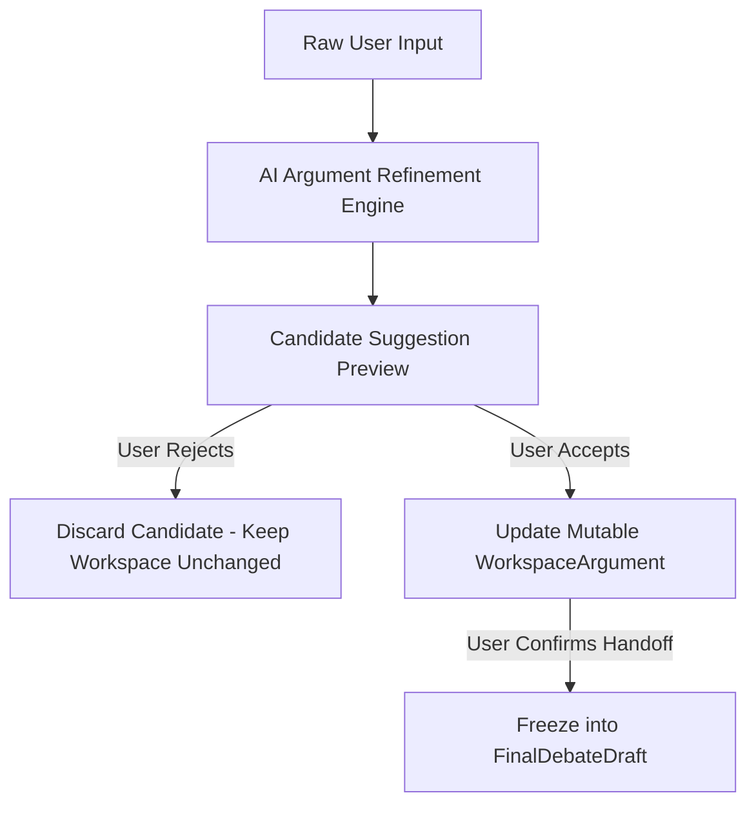
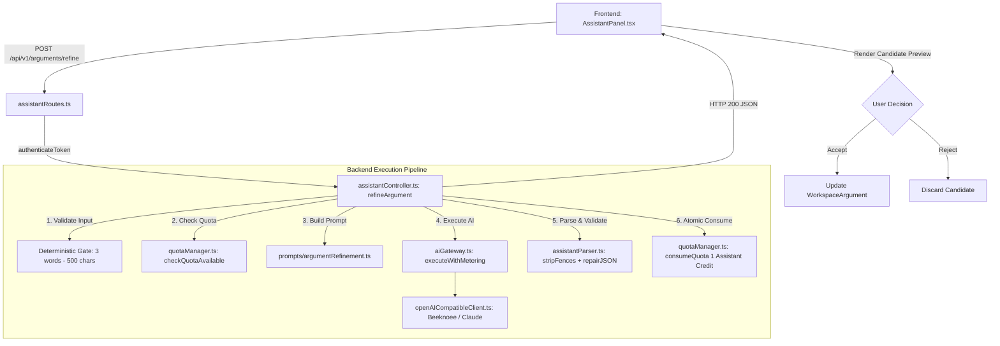
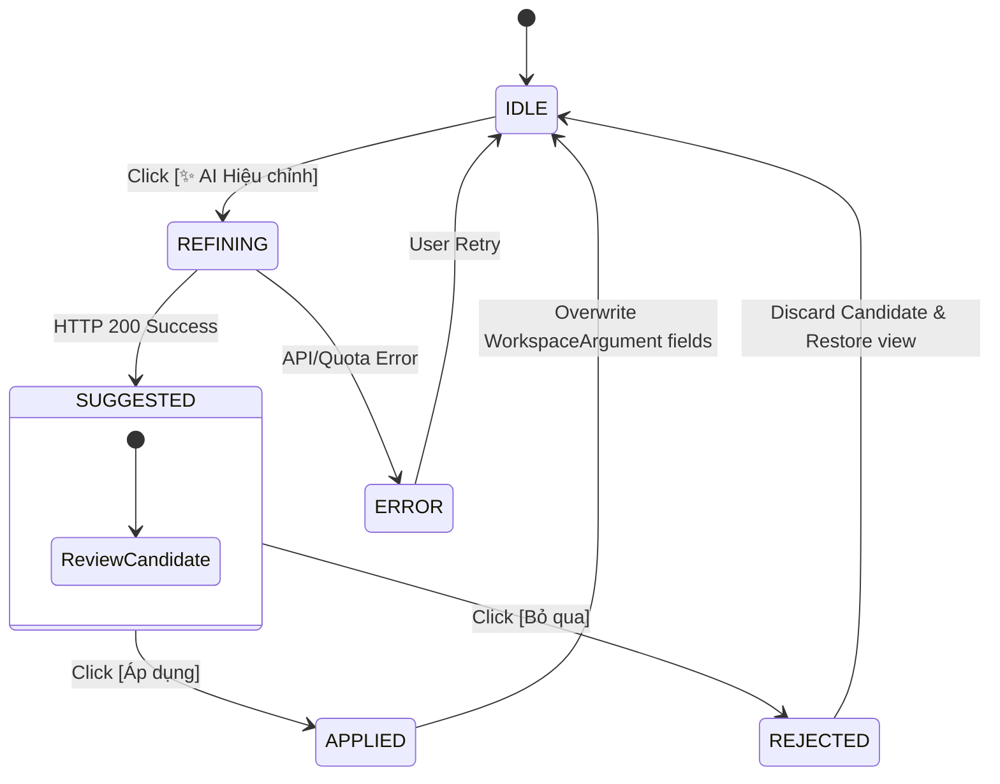

# AI_ARGUMENT_REFINEMENT_SPEC — ĐẶC TẢ TÍNH NĂNG HIỆU CHỈNH LUẬN ĐIỂM AI (V1.0)
> **Source of Truth:** Master Blueprint V15.0 (`ai-debate-master-blueprint-v15.pdf`) / Thinking OS v16.0
> **Tài liệu tham chiếu:** `docs/00_MASTER_SPEC.md`, `docs/01_ARCHITECTURE.md`, `docs/02_DOMAIN_SPEC.md`, `docs/04_API_SPEC.md`, `docs/15_COST_METERING_SPEC.md`, `docs/16_PLAN_QUOTA_BUSINESS_SPEC.md`
> **Trạng thái:** 🟢 PRODUCTION-READY SPECIFICATION
> **Phiên bản:** 1.0.0 (Ngày ban hành: 25/08/2026)
> **Phạm vi:** Assistant Domain (Deep Prep Room Extension) & Thinking OS Argument Scaffolding

---

## 1. Document Status

| Thuộc tính | Giá trị |
| :--- | :--- |
| **Mã đặc tả** | `SPEC-AI-AR-01` |
| **Tên tính năng** | **AI Argument Refinement (Hiệu chỉnh Luận điểm bằng AI)** |
| **Phiên bản** | `v1.0.0` (LOCKED) |
| **Cấp độ kiến trúc** | Logical Microservice trong Modular Monolith |
| **Phạm vi tác động** | Assistant Domain (`DraftWorkspaceState`), Tầng tiền xử lý Luận điểm |
| **Ràng buộc bất biến** | **100% Không xâm phạm `FinalDebateDraft` và Core Arena State Machine** |

---

## 2. Purpose (Mục Tiêu Tính Năng)

AI Argument Refinement là công cụ cố vấn sư phạm (Pedagogical Scaffolding Tool) giúp người học:
> **Biến các ý tưởng hoặc luận điểm thô (Raw Ideas / Fragmented Arguments) thành một luận điểm hoàn chỉnh, sắc bén và có cấu trúc chặt chẽ theo mô hình chuẩn C-R-E (Claim - Reasoning - Evidence Suggestion), đồng thời BẢO TOÀN TUYỆT ĐỐI ý nghĩa gốc và lập trường của người học.**

```text
[Ý tưởng thô / Luận điểm sơ khai của người học]
                    ↓ (AI Argument Refinement)
[Luận điểm chuẩn C-R-E: Khẳng định rõ - Lập luận logic - Định hướng dẫn chứng]
```

### Ranh giới định vị (Pedagogical Invariants):
* ✅ **HỖ TRỢ TƯ DUY:** Tinh chỉnh câu chữ, làm rõ quan hệ nhân quả (Cause-and-Effect), gọt giũa cấu trúc C-R-E.
* ❌ **KHÔNG VIẾT HỘ:** AI không thay thế người học nghĩ ra toàn bộ case tranh biện.
* ❌ **KHÔNG ĐỔI LẬP TRƯỜNG:** AI không tự ý chuyển hướng từ Ủng hộ sang Phản đối hoặc ngược lại.
* ❌ **KHÔNG BỊA ĐẶT SỐ LIỆU:** AI không tự chế số liệu thống kê hoặc trích dẫn nguồn giả mạo.
* ❌ **KHÔNG TỰ Ý ÁP ĐẶT:** AI không tự động ghi đè dữ liệu nếu chưa có sự đồng ý (Explicit Accept) từ người học.

---

## 3. Blueprint Compatibility

Tính năng AI Argument Refinement tương thích 100% với các trụ cột của Master Blueprint V15/V16:
1. **Chuẩn hóa C-R-E:** Tuân thủ mô hình chẩn đoán tư duy C-R-E theo chuẩn WSDC/AP/BP (`docs/00_MASTER_SPEC.md §1`).
2. **Pedagogical Assistant Domain:** Đóng vai trò trợ lý hỗ trợ trong phòng chuẩn bị sâu (Deep Prep Room) (`docs/02_DOMAIN_SPEC.md §2.4`).
3. **Zero Waste LLM Rule:** Giữ prompt súc tích, khống chế `max_tokens <= 800`, không gọi LLM lãng phí (`docs/00_MASTER_SPEC.md §3.1`).
4. **Atomic Quota Protection:** Khấu trừ hạn ngạch theo mô hình Fail-Closed Post-Validation (`docs/16_PLAN_QUOTA_BUSINESS_SPEC.md §3`).
5. **Strict Single Identity & Security:** Tuân thủ COPPA và Nghị định 13/2023/NĐ-CP (`docs/10_SECURITY_SPEC.md §1-§2`).

---

## 4. Scope (Phạm Vi V1 — Locked)

Trong phiên bản V1, tính năng **CHỈ HỖ TRỢ HIỆU CHỈNH LUẬN ĐIỂM (ARGUMENT REFINEMENT)**:



* **Điểm kích hoạt:** Trên từng Card Luận Điểm (`WorkspaceArgument`) trong giao diện Draft Workspace của `AssistantPanel.tsx`.
* **Đối tượng xử lý:** Một luận điểm đơn lẻ gồm: Text thô (`rawText`) + Lập trường (`stance`) + Ngữ cảnh kiến nghị (`topic`, `existingClaim`, `existingReasoning`, `existingEvidenceSuggestion`).
* **Đầu ra:** Bản đề xuất tạm thời (`Candidate Suggestion`) gồm 3 trường C-R-E và 1 lời giải thích ngắn gọn (`refinementNote`).

---

## 5. Out of Scope (Ngoài Phạm Vi V1)

Các hạng mục sau **TUYỆT ĐỐI KHÔNG TRIỂN KHAI TRONG V1**:
* ❌ Hiệu chỉnh phản biện đối kháng (Counterargument / Rebuttal Refinement).
* ❌ Sinh toàn bộ bài phát biểu tự động (Full Speech Auto-generation).
* ❌ Tự động phản hồi trong trận đấu Arena (Automatic Arena Turn Generation).
* ❌ Tự động áp dụng kết quả mà không qua User duyệt (AI Auto-apply).
* ❌ Lưu trữ lịch sử phiên bản vào cơ sở dữ liệu PostgreSQL (Persistent Database Revision History).
* ❌ Hệ thống Undo/Redo đa tầng.
* ❌ Màn hình Dashboard quản lý Refinement độc lập.
* ❌ Tạo loại Credit hoặc Token mới ngoài ví `assistantRemaining`.
* ❌ Xác thực tính chính xác của dẫn chứng thực tế (AI Fact Checking / Live Web Search / Citation Verification).

---

## 6. Core Principles (Nguyên Tắc Cốt Lõi)

1. **AI NEVER MODIFIES `FinalDebateDraft` DIRECTLY:** Mọi can thiệp của AI chỉ được dừng lại ở tầng đề xuất (`Candidate Suggestion`) trước khi người học xác nhận.
2. **Semantic Core Preservation Invariant:** Ý nghĩa gốc, lập luận trung tâm và lập trường của người học là bất biến.
3. **User in the Loop:** Mọi thay đổi vào `WorkspaceArgument` bắt buộc phải có thao tác `[Áp dụng]` tường minh từ người học.
4. **Fail-Closed & Post-Validation Metering:** Quota chỉ bị trừ khi AI trả về kết quả hợp lệ và vượt qua Schema Validation.
5. **Stateless Backend Refinement:** Backend không duy trì trạng thái hay tạo bản ghi rác trong cơ sở dữ liệu khi người học thử nghiệm hiệu chỉnh.

---

## 7. Domain Terminology (Thuật Ngữ Nghiệp Vụ)

| Thuật ngữ | Định nghĩa nghiệp vụ |
| :--- | :--- |
| **`Raw Input`** | Ý tưởng thô, câu nói sơ khai hoặc đoạn văn chưa chuẩn hóa do người học nhập vào. |
| **`Claim`** | Luận điểm khẳng định rõ ràng, có tính tranh biện, liên kết trực tiếp với kiến nghị (`topic`) và lập trường (`stance`). |
| **`Reasoning`** | Lập luận logic nhân quả giải thích lý do vì sao Claim lại đúng và có giá trị thuyết phục. |
| **`Evidence Suggestion`** | Gợi ý định hướng loại số liệu, nghiên cứu hoặc ví dụ thực tế cần tìm kiếm (KHÔNG phải số liệu đã kiểm chứng). |
| **`Refinement Note`** | Giải thích sư phạm ngắn gọn (1-2 câu) của AI về các điểm đã được cải thiện logic/câu chữ. |
| **`Candidate Suggestion`** | Dữ liệu đề xuất tạm thời nằm trong bộ nhớ client, chưa ghi đè vào Workspace. |
| **`DraftWorkspaceState`** | Trạng thái biên tập có thể thay đổi (Mutable Authoring State) trong giao diện Assistant. |
| **`FinalDebateDraft`** | Bản thảo chính thức bất biến (Immutable Confirmed Handoff Snapshot) sau khi người học xác nhận để chuyển sang Arena. |

---

## 8. Architecture Overview



---

## 9. User Flow (Luồng Trải Nghiệm Người Dùng)

```text
BƯỚC 1: Người học mở Draft Workspace trong Assistant Panel.
BƯỚC 2: Tại một Card Luận Điểm, người học nhập ý tưởng vào ô Claim / Reasoning / Text thô.
BƯỚC 3: Người học bấm nút [ ✨ AI Hiệu chỉnh ].
BƯỚC 4: Frontend khóa nút (disabled), hiển thị trạng thái loading spinner "AI đang tối ưu hóa luận điểm...".
BƯỚC 5: Backend kiểm tra hợp lệ, kiểm tra quota, gọi AI và trả về Candidate Suggestion.
BƯỚC 6: Frontend hiển thị khung "Bản Đề Xuất C-R-E (AI Suggestion)" ngay dưới Card:
         - Claim đề xuất
         - Reasoning đề xuất
         - Evidence Suggestion đề xuất
         - Ghi chú: refinementNote
         - Hai nút hành động: [ Áp dụng (Accept) ] và [ Bỏ qua (Reject) ]
BƯỚC 7A [User bấm Áp dụng]: Dữ liệu candidate được điền vào các ô Claim, Reasoning, Evidence Suggestion của Card. Khung preview đóng lại.
BƯỚC 7B [User bấm Bỏ qua]: Khung preview đóng lại, toàn bộ nội dung trong Card được giữ nguyên vẹn như trước khi bấm nút.
```

---

## 10. Mutability & FinalDebateDraft Boundary

### Ranh giới bất biến (Hard Invariant Boundary):

```text
┌─────────────────────────────────────────────────────────────────────────────┐
│                       MUTABLE AUTHORING BOUNDARY                            │
│                                                                             │
│   DraftWorkspaceState (Mutable React State)                                 │
│   ├── workspaceHook                                                         │
│   ├── workspaceArgs: WorkspaceArgument[]  ◄─── [ AI REFINEMENT OPERATES ]   │
│   │   ├── argumentId (Invariant UUID)                                       │
│   │   ├── order                                                             │
│   │   ├── claim                                                             │
│   │   ├── reasoning                                                         │
│   │   └── evidenceSuggestion                                                │
│   └── workspaceCounters: WorkspaceCounterargument[]                         │
│                                                                             │
└──────────────────────────────────────┬──────────────────────────────────────┘
                                       │
                         [ USER EXPLICIT CONFIRM ]
                         (handleConfirmAndHandoff)
                                       │
                                       ▼
┌─────────────────────────────────────────────────────────────────────────────┐
│                      IMMUTABLE HANDOFF BOUNDARY                             │
│                                                                             │
│   FinalDebateDraft (FROZEN READONLY CONTRACT)                               │
│   ├── draftId: string                                                       │
│   ├── topic: string                                                         │
│   ├── stance: DebateStance                                                  │
│   ├── hook: string                                                          │
│   ├── arguments: readonly FinalArgument[]       ◄─── [ AI CANNOT TOUCH ]    │
│   ├── counterarguments: readonly FinalCounterargument[]                     │
│   ├── conclusion: string                                                    │
│   ├── isUserConfirmed: true                                                 │
│   └── confirmedAt: string (ISO Timestamp)                                   │
│                                                                             │
└─────────────────────────────────────────────────────────────────────────────┘
```

> **QUY TẮC BẤT DI BẤT DỊCH:**
> 1. Không bao giờ cho phép AI gọi hiệu chỉnh trực tiếp trên object `FinalDebateDraft`.
> 2. `FinalDebateDraft`, `FinalArgument`, `FinalCounterargument`, và `ArenaHandoffPayload` không được thêm/sửa/xóa bất kỳ trường nào.

---

## 11. API Contract

### Danh mục Endpoint

| Method | Path | Auth | Quota Action | Cost / Limit | Description |
| :--- | :--- | :--- | :--- | :--- | :--- |
| `POST` | `/api/v1/arguments/refine` | Bearer JWT | `ASSISTANT_DRAFT` | 1 Assistant Credit | Hiệu chỉnh ý tưởng thô thành luận điểm C-R-E |

### 11.1. Request Specifications

* **Endpoint:** `POST /api/v1/arguments/refine`
* **Headers:**
  ```http
  Authorization: Bearer <jwt_token>
  Content-Type: application/json
  ```
* **Payload Body (`ArgumentRefinementRequest`):**
  ```typescript
  export interface ArgumentRefinementRequest {
    rawText: string;
    stance: 'AFFIRMATIVE' | 'NEGATIVE';
    topic?: string;
    existingClaim?: string;
    existingReasoning?: string;
    existingEvidenceSuggestion?: string;
    language?: 'vi' | 'en';
  }
  ```

* **Ví dụ Request Payload:**
  ```json
  {
    "rawText": "mang xa hoi lam hoc sinh luoi hoc voi tram cam suot ngay so sanh",
    "stance": "AFFIRMATIVE",
    "topic": "Học sinh dưới 16 tuổi không nên sử dụng mạng xã hội",
    "language": "vi"
  }
  ```

---

### 11.2. Success Response Specifications (HTTP 200 OK)

* **Payload Response (`ArgumentRefinementResponse`):**
  ```typescript
  export interface ArgumentRefinementResponse {
    success: true;
    data: {
      claim: string;
      reasoning: string;
      evidenceSuggestion: string;
      refinementNote: string;
    };
  }
  ```

* **Ví dụ Response Payload:**
  ```json
  {
    "success": true,
    "data": {
      "claim": "Mạng xã hội gây suy giảm kết quả học tập và gia tăng nguy cơ trầm cảm ở học sinh do tâm lý so sánh tiêu cực.",
      "reasoning": "Thuật toán tối ưu hóa thời gian giữ chân khiến học sinh mất tập trung vào việc học, đồng thời việc liên tục tiếp xúc với hình ảnh lý tưởng hóa của người khác tạo ra áp lực tâm lý và hội chứng FOMO.",
      "evidenceSuggestion": "Nên tìm kiếm báo cáo của Hiệp hội Tâm lý học Hoa Kỳ (APA) về thời gian sử dụng màn hình hoặc số liệu UNICEF về sức khỏe tâm thần vị thành niên.",
      "refinementNote": "Đã chuẩn hóa ngôn ngữ học thuật, phân tách rõ luận điểm chính và lập luận nhân quả, bổ sung định hướng dẫn chứng tâm lý học."
    }
  }
  ```

---

### 11.3. Error Responses Specifications

| HTTP Status | Error Code | Nguyên nhân | Quota Consumed |
| :--- | :--- | :--- | :---: |
| **400 Bad Request** | `INVALID_INPUT` | `rawText` rỗng, dưới 3 từ, trên 500 ký tự, hoặc thiếu `stance`. | **0** |
| **401 Unauthorized** | `UNAUTHENTICATED` / `SESSION_REVOKED` | Thiếu token, token hết hạn, hoặc bị gentle eviction. | **0** |
| **403 Forbidden** | `QUOTA_EXCEEDED` | `assistantRemaining <= 0` trong `user_quotas`. | **0** |
| **422 Unprocessable** | `INVALID_AI_OUTPUT` | Output AI không parse được JSON hoặc vi phạm C-R-E schema. | **0** |
| **502 Bad Gateway** | `AI_SERVICE_UNAVAILABLE` | Nhà cung cấp AI (Beeknoee/Groq/OpenAI) lỗi kết nối hoặc HTTP 5xx. | **0** |
| **504 Gateway Timeout**| `AI_TIMEOUT` | Yêu cầu AI vượt quá 120s timeout. | **0** |
| **500 Server Error** | `INTERNAL_ERROR` | Lỗi máy chủ nội bộ. | **0** |

---

## 12. Input Contract (Quy Tắc Đầu Vào)

1. **`rawText` (Bắt buộc):**
   * Chuỗi văn bản thô đại diện cho ý tưởng của người học.
   * Ràng buộc độ dài:
     * **Tối thiểu:** 3 từ có nghĩa (Loại trừ filler words như `ừm`, `à`, `thì`, `là`).
     * **Tối đa:** 500 ký tự (Đảm bảo tính súc tích của 1 luận điểm, tránh paste cả bài luận).
2. **`stance` (Bắt buộc):**
   * Giá trị hợp lệ: `'AFFIRMATIVE'` (Ủng hộ) hoặc `'NEGATIVE'` (Phản đối).
   * AI **TUYỆT ĐỐI KHÔNG ĐƯỢC ĐỔI LẬP TRƯỜNG**.
3. **`topic` (Tùy chọn):**
   * Chủ đề kiến nghị của trận đấu (ví dụ: *"Chúng tôi sẽ cấm phát triển vũ khí tự hành"*).
   * Dùng để định hướng tính phù hợp của Claim.
4. **`existing C-R-E` (Tùy chọn):**
   * Nếu người học đã có sẵn Claim/Reasoning/Evidence, AI sẽ ưu tiên làm rõ và nâng cấp dựa trên các mảnh ghép này.

---

## 13. Output Contract (Quy Tắc Đầu Ra)

Output trả về từ AI bắt buộc phải là một JSON object với 4 trường tiếng Anh (English Keys):

```json
{
  "claim": "string (1-2 câu)",
  "reasoning": "string (2-3 câu)",
  "evidenceSuggestion": "string (1-2 câu)",
  "refinementNote": "string (1-2 câu)"
}
```

* Không trả về markdown fences (no ````json ... ````).
* Không trả về lời chào, phần mở đầu hay kết thúc ngoài JSON.
* Nội dung các trường (values) viết bằng ngôn ngữ được yêu cầu (mặc định: Tiếng Việt).

---

## 14. C-R-E Contract

### 14.1. Claim (Luận Điểm)
* Phải là một câu khẳng định trực diện, gãy gọn, nêu rõ quan điểm tranh biện.
* Phải phản ánh chính xác thông điệp cốt lõi từ `rawText` của người học.
* Độ dài tối ưu: 15–30 từ (1 đến 2 câu ngắn).

### 14.2. Reasoning (Lập Luận)
* Phải giải thích chuỗi logic nguyên nhân - hệ quả: **Vì sao A dẫn đến B, và tại sao B lại quan trọng đối với kiến nghị?**
* Phải giữ nguyên các giả định hợp lý của người học, không được tự ý thay đổi bản chất lập luận sang một góc nhìn hoàn toàn xa lạ.
* Độ dài tối ưu: 35–70 từ (2 đến 3 câu).

### 14.3. Evidence Suggestion (Định Hướng Dẫn Chứng)
* Phải chỉ ra **hướng đi tìm kiếm chứng cứ**: loại số liệu, tên báo cáo/tổ chức nghiên cứu uy tín trong ngành liên quan, hoặc ví dụ điển hình cần dẫn.
* Phải mang tính gợi mở phương pháp (Methodological Guidance).
* Nếu `rawText` không có dữ liệu để gợi ý, trả về chuỗi định hướng chung hoặc chuỗi rỗng `""`.

---

## 15. Semantic Preservation Contract (Bảo Toàn Ngữ Nghĩa)

> **HARD PEDAGOGICAL REQUIREMENT:**
> **Bảo toàn ngữ nghĩa (Meaning Preservation) KHÔNG đồng nghĩa với việc giữ nguyên từng từ ngữ (Sentence Preservation).**

### 15.1. Những gì AI ĐƯỢC PHÉP làm:
* Sửa lỗi chính tả, lỗi ngữ pháp, lỗi diễn đạt lủng củng.
* Thay thế từ ngữ thông tục bằng thuật ngữ học thuật/tranh biện chuẩn mực.
* Sắp xếp lại trật tự các câu để làm nổi bật tính liên kết logic.
* Tách biệt rõ ràng đâu là Khẳng định (Claim), đâu là Lý lẽ (Reasoning).
* Làm rõ các ẩn ý (Implicit Premises) mà người học đã đề cập sơ sài.

### 15.2. Những gì AI TUYỆT ĐỐI BỊ CẤM:
* ❌ Đổi ngược hoặc làm lệch lập trường (Stance Reversal / Drift).
* ❌ Thay thế một luận điểm yếu của người học bằng một luận điểm hoàn toàn khác (dù luận điểm mới có hay hoặc mạnh hơn).
* ❌ Loại bỏ các luận cứ then chốt mà người học muốn nhấn mạnh.
* ❌ Thêm vào các tiền đề gây tranh cãi về mặt đạo đức/chính trị nằm ngoài ý của người học.

---

## 16. Evidence Safety Contract (Chống Bịa Đặt Dẫn Chứng)

Để bảo đảm tính trung thực học thuật và an toàn cho người học:
1. **NO FAKE STATS:** Tuyệt đối không tự bịa các con số chi tiết nếu người học không cung cấp (ví dụ: KHÔNG ĐƯỢC tự viết *"Theo khảo sát có 87.5% học sinh bị..."*).
2. **NO FAKE INSTITUTES/URLS:** Không tự nghĩ ra tên tổ chức không có thật hoặc đường link giả.
3. **METHODOLOGICAL FRAMING:** Luôn sử dụng cấu trúc gợi ý: *"Nên tham khảo số liệu từ..."*, *"Có thể tìm dẫn chứng về trường hợp..."*.

---

## 17. AI Behavior Contract (Prompt Engineering Rules)

### Thứ tự ưu tiên bất biến trong System Prompt (Priority Ladder):
1. **Preserve User Meaning & Stance:** Tuyệt đối trung thành với ý định gốc và lập trường của người học.
2. **Pedagogical Clarity:** Diễn đạt gãy gọn, sáng rõ, chuẩn văn phong tranh biện học thuật.
3. **Rigorous C-R-E Structure:** Tách bạch Claim, Reasoning, Evidence Suggestion.
4. **Anti-Hallucination:** Gợi ý định hướng dẫn chứng, không bịa đặt số liệu cụ thể.
5. **Strict JSON Output:** Trả về duy nhất JSON object theo đúng schema quy định.

* **Tham số mô hình khuyến nghị:**
  * `temperature`: `0.3 - 0.4` (Ưu tiên tính ổn định, chính xác và bảo thủ).
  * `max_tokens`: `800`.

---

## 18. Candidate Revision Model (Transient Only)

Hệ thống **KHÔNG tạo bảng cơ sở dữ liệu** cho Candidate Revision trong V1. Trạng thái chỉ tồn tại tạm thời trong React Component State:

```typescript
export interface ArgumentRefinementCandidate {
  claim: string;
  reasoning: string;
  evidenceSuggestion: string;
  refinementNote: string;
}

export interface CardRefinementState {
  originalClaim: string;
  originalReasoning: string;
  originalEvidenceSuggestion: string;
  candidate: ArgumentRefinementCandidate | null;
  status: 'IDLE' | 'REFINING' | 'SUGGESTED' | 'APPLIED' | 'REJECTED' | 'ERROR';
  errorMessage?: string;
}
```

---

## 19. Frontend State Contract

1. Quản lý trạng thái theo từng `argumentId`:
   * Mỗi Card trong Draft Workspace sở hữu một state `CardRefinementState` độc lập.
2. Không gây ảnh hưởng chéo giữa các Card:
   * Việc Card 1 đang gọi AI hiệu chỉnh không làm khóa hoặc thay đổi dữ liệu của Card 2 hay Card 3.
3. In-flight Lock:
   * Khóa nút `[ ✨ AI Hiệu chỉnh ]` của chính Card đang xử lý để tránh spam click.

---

## 20. Accept / Reject Contract



* **Khi người học bấm `[Áp dụng]`:**
  * Ghi đè: `workspaceArg.claim = candidate.claim`
  * Ghi đè: `workspaceArg.reasoning = candidate.reasoning`
  * Ghi đè: `workspaceArg.evidenceSuggestion = candidate.evidenceSuggestion`
  * Đóng khung preview, giải phóng `candidate = null`.
* **Khi người học bấm `[Bỏ qua]`:**
  * Giữ nguyên toàn bộ nội dung hiện tại của Card.
  * Đóng khung preview, giải phóng `candidate = null`.

---

## 21. Quota Policy (Khóa Quyết Định V1)

* **Quy tắc tính phí:**
  > **1 Lượt AI Argument Refinement thành công = 1 Assistant Credit (`assistantRemaining`).**
* **Ví trừ hạn ngạch:** `assistantRemaining` trong bảng `user_quotas`.
* **Không sinh ví mới:** Tái sử dụng hoàn toàn danh mục gói cước hiện hành (`16_PLAN_QUOTA_BUSINESS_SPEC.md`).

---

## 22. Quota Execution Rules

Quy trình trừ quota áp dụng mô hình **Post-Validation Atomic Deduct (Fail-Closed)**:

```text
1. Xác thực danh tính JWT (authenticateToken) -> userId
2. Kiểm tra sơ bộ: checkQuotaAvailable(userId, 'ASSISTANT_DRAFT', 1)
   └─ Nếu không đủ -> Trả HTTP 403 (0 cuộc gọi AI, 0 trừ quota)
3. Gọi LLM qua AI Gateway
4. Parse & Validate Schema Output C-R-E
   └─ Nếu parse thất bại / cụt / lỗi -> Trả HTTP 422 (0 trừ quota)
5. Trừ Quota nguyên tử: consumeQuota(userId, 'ASSISTANT_DRAFT', 1)
   └─ Sử dụng Row-level Locking với điều kiện assistantRemaining > 0
6. Trả kết quả HTTP 200 cho người học
```

---

## 23. Quota = 0 Behavior

Khi số dư `assistantRemaining = 0`:
1. **Backend:**
   * Hàm `checkQuotaAvailable` trả về `decision: 'QUOTA_EXCEEDED'`.
   * Trả về ngay lập tức HTTP 403 Forbidden với body:
     ```json
     {
       "success": false,
       "error": "QUOTA_EXCEEDED",
       "code": "QUOTA_EXCEEDED",
       "message": "Bạn đã hết lượt Cố vấn AI trong chu kỳ hiện tại. Vui lòng nạp thêm gói Assistant Boost để tiếp tục sử dụng tính năng Hiệu chỉnh Luận điểm.",
       "dimension": "assistant"
     }
     ```
   * **TUYỆT ĐỐI KHÔNG GỌI NHÀ CUNG CẤP AI.**
2. **Frontend:**
   * Giữ nguyên 100% văn bản người học đang nhập dở (không làm mất dữ liệu).
   * Hiển thị thông báo Toast / Banner cảnh báo hết hạn ngạch kèm nút mở `PricingModal` để nạp thêm gói `PACK_ASST_5`.

---

## 24. Telemetry & Cost Metering

* **Tái sử dụng AI Gateway:** Gọi qua hàm chuẩn `executeWithMetering()` trong `backend/src/services/aiGateway.ts`.
* **Thông số Telemetry:**
  * `serviceType`: `'LLM_ASSISTANT'`
  * `taskName`: `'Argument_Refinement'`
  * `modelName`: Đọc từ `MODEL_ASSISTANT` hoặc `MODEL_LOGIC_COACH`
  * Ghi nhận: `promptTokens`, `completionTokens`, `costUsd`, `latencyMs` vào bảng `usage_logs`.
* **Ghi nhận SPEC GAP:**
  > Hiện tại bảng `usage_logs` trong Prisma chưa có cột `task_name` riêng biệt. Tạm thời ghi nhận qua logging console và lưu trữ tổng hợp qua `serviceType`.

---

## 25. Anti-Abuse (Chống Lạm Dụng & Chống Spam)

1. **Input Bounds Gate:**
   * Tối thiểu 3 từ có nghĩa.
   * Tối đa 500 ký tự.
   * Bác bỏ các chuỗi spam lặp ký tự (ví dụ: `aaaaaaa`, `11111111`).
2. **In-Flight Concurrency Lock:**
   * Mỗi Card chỉ được phép có tối đa 1 request hiệu chỉnh đang thực thi tại một thời điểm.
3. **Global Rate Limiting:**
   * Tái sử dụng `rateLimiter` middleware (Tối đa 30 requests / phút / IP).
4. **Retry Guard:**
   * Frontend không tự động gửi lại (no auto-infinite retry) khi gặp lỗi 4xx/5xx. Người học phải bấm lại thủ công.

---

## 26. Security & Authorization

1. **Identity Extraction:**
   * `userId` được trích xuất duy nhất từ JWT đã xác minh (`req.userId`), tuyệt đối không chấp nhận `userId` truyền từ request body.
2. **Single Active Session:**
   * Tự động kiểm tra tính hợp lệ qua `SessionRegistry.isActiveSession`. Nếu bị đăng nhập từ thiết bị khác, yêu cầu bị từ chối với mã `SESSION_REVOKED`.
3. **Stateless Privacy:**
   * Ý tưởng thô gửi lên hiệu chỉnh không bị lưu trữ vĩnh viễn vào DB nếu người học không bấm xác nhận lưu trận đấu/bản thảo, tuân thủ quyền riêng tư COPPA và Nghị định 13/2023/NĐ-CP.

---

## 27. Error Contract (Chi Tiết Mã Lỗi & Xử Lý)

```typescript
export interface ApiErrorResponse {
  success: false;
  error: string;
  code: string;
  message: string;
  dimension?: string;
}
```

| Error Code | HTTP Status | Thông báo hiển thị cho người học | Hành vi Frontend |
| :--- | :---: | :--- | :--- |
| `INVALID_INPUT` | 400 | "Nội dung ý tưởng quá ngắn (tối thiểu 3 từ) hoặc quá dài (tối đa 500 ký tự)." | Báo đỏ dưới ô input, giữ nguyên text. |
| `UNAUTHENTICATED` | 401 | "Phiên đăng nhập đã hết hạn. Vui lòng đăng nhập lại." | Mở AuthModal. |
| `QUOTA_EXCEEDED` | 403 | "Hạn ngạch Cố vấn AI đã hết. Hãy nạp thêm gói Assistant Boost." | Mở PricingModal. |
| `INVALID_AI_OUTPUT` | 422 | "AI trả về kết quả không đúng cấu trúc C-R-E. Vui lòng thử lại." | Hiển thị nút "Thử lại", không trừ credit. |
| `AI_SERVICE_UNAVAILABLE` | 502 | "Hệ thống AI đang bảo trì hoặc gặp sự cố tạm thời. Vui lòng thử lại sau." | Hiển thị thông báo lỗi hệ thống. |
| `AI_TIMEOUT` | 504 | "Thời gian phản hồi của AI quá lâu. Vui lòng thử lại." | Cho phép bấm thử lại. |

---

## 28. Validation & Safety Gates

```text
[CLIENT REQUEST]
       │
       ▼
[Gate 1: Input Validation Gate]
- rawText length: [3 words, 500 chars]
- stance in ['AFFIRMATIVE', 'NEGATIVE']
- non-empty, non-filler
       │
       ▼ (PASS)
[Gate 2: Quota Pre-Check Gate]
- checkQuotaAvailable(userId, 'ASSISTANT_DRAFT', 1) === 'ALLOW'
       │
       ▼ (PASS)
[Gate 3: AI Generation & Parser Gate]
- stripMarkdownFences()
- extractOutermostJsonObject()
- repairTruncatedJson()
       │
       ▼ (PASS)
[Gate 4: C-R-E Schema & Semantic Gate]
- claim, reasoning, evidenceSuggestion exist & non-empty
- stance not altered
       │
       ▼ (PASS)
[Gate 5: Atomic Quota Consumption Gate]
- consumeQuota(userId, 'ASSISTANT_DRAFT', 1)
       │
       ▼ (SUCCESS)
[RETURN HTTP 200 TO CLIENT]
```

---

## 29. Testing Contract (Acceptance Test Suite: AR-01 đến AR-13)

Tất cả các test case sau phải được cài đặt trong `backend/src/__tests__/argumentRefinement.test.ts` trước khi release:

| Test ID | Tên Test Case | Điều kiện kiểm thử | Kết quả kỳ vọng |
| :--- | :--- | :--- | :--- |
| **AR-01** | Basic Refinement Happy Path | Gửi `rawText` tiếng Việt hợp lệ và `stance = 'AFFIRMATIVE'`. | Trả về HTTP 200, đúng schema C-R-E, `refinementNote` có nội dung. |
| **AR-02** | Semantic Preservation | Gửi ý tưởng phê phán mạng xã hội. | Output Claim và Reasoning giữ đúng lập trường phản đối, không bị đổi sang khen ngợi. |
| **AR-03** | Evidence Safety | Gửi ý tưởng thiếu số liệu. | AI trả về định hướng tìm kiếm dẫn chứng, không sinh số liệu bịa đặt. |
| **AR-04** | User Accept Action | Frontend nhận candidate và bấm Áp dụng. | Dữ liệu `WorkspaceArgument` được cập nhật, `FinalDebateDraft` chưa bị ảnh hưởng. |
| **AR-05** | User Reject Action | Frontend nhận candidate và bấm Bỏ qua. | Dữ liệu `WorkspaceArgument` giữ nguyên 100% như ban đầu. |
| **AR-06** | FinalDebateDraft Invariant | Thực hiện Refinement rồi bấm Handoff. | `FinalDebateDraft` tạo ra có đầy đủ `draftId`, `isUserConfirmed: true`, schema chuẩn. |
| **AR-07** | Quota Success | Refinement thành công vượt qua validation. | `assistantRemaining` giảm chính xác 1 đơn vị. |
| **AR-08** | Quota Failure | AI provider trả về lỗi 500 hoặc timeout. | `assistantRemaining` không bị trừ (giữ nguyên). |
| **AR-09** | Quota Zero Lock | User có `assistantRemaining = 0`. | Trả về HTTP 403, số lượt gọi AI provider bằng 0. |
| **AR-10** | Telemetry Tagging | Gọi refine argument thành công. | Ghi nhận telemetry với `taskName = 'Argument_Refinement'`. |
| **AR-11** | Input Abuse Gate | Gửi `rawText` dài 600 ký tự hoặc chỉ chứa từ đệm `ừm à`. | Bị chặn ở tầng Validation, trả về HTTP 400, không gọi AI. |
| **AR-12** | Duplicate In-Flight Guard | Gửi 2 request đồng thời trên 1 card. | Request thứ 2 bị chặn hoặc từ chối tại client/backend. |
| **AR-13** | Malformed Output Resilience | Mock AI trả về JSON thiếu ngoặc hoặc bọc trong markdown fence. | Parser tự động gọt fence và vá JSON thành công, trả về HTTP 200. |

---

## 30. Implementation Boundaries (Ranh Giới Thực Thi)

### 30.1. File được phép tạo mới khi Implementation:
* `backend/src/prompts/argumentRefinement.ts` (Prompt Builder)
* `backend/src/__tests__/argumentRefinement.test.ts` (Unit & Integration Tests)

### 30.2. File được phép chỉnh sửa:
* `backend/src/routes/assistantRoutes.ts` (Mount endpoint `POST /speeches/arguments/refine` hoặc `POST /arguments/refine`)
* `backend/src/controllers/assistantController.ts` (Thêm hàm `refineArgument`)
* `frontend/src/lib/api.ts` (Thêm interfaces request/response và hàm `refineArgumentApi`)
* `frontend/src/components/AssistantPanel.tsx` (Tích hợp nút AI và Candidate preview UI trên Card)

### 30.3. DO NOT TOUCH (TUYỆT ĐỐI CẤM SỬA):
* ⛔ `FinalDebateDraft`, `FinalArgument`, `FinalCounterargument`, `ArenaHandoffPayload` trong `api.ts`.
* ⛔ Core Arena Engine & Session Controller (`debateController.ts`).
* ⛔ Logic Coach Prompt & Parser (`logicCoach.ts`, `logicCoachParser.ts`).
* ⛔ AI Gateway Wrapper Core (`aiGateway.ts`).
* ⛔ Prisma Schema & Database Migrations (`schema.prisma`).
* ⛔ Giao diện ArgumentMapHUD (`ArgumentMapHUD.tsx`).

---

## 31. SPEC GAP Register

| ID | Vấn đề thiếu hụt (SPEC GAP) | Trạng thái hiện tại | Quyết định trong Spec V1 |
| :---: | :--- | :--- | :--- |
| **GAP-01** | **Revision History Persistence** | Blueprint chưa yêu cầu lưu lịch sử sửa đổi argument trong DB. | **V1:** Chỉ lưu transient state trên React Component, không sửa PostgreSQL schema. |
| **GAP-02** | **Semantic Preservation Validation** | Khó dùng code deterministic để kiểm tra 100% ngữ nghĩa. | **V1:** Áp dụng Prompt-level strict guardrails (`temperature 0.3`) + Post-generation stance verification. |
| **GAP-03** | **Telemetry Task Dimension** | Bảng `usage_logs` chưa có trường `task_name`. | **V1:** Truyền qua `aiGateway` logger console; ghi nhận task schema migration cho Phase 3. |
| **GAP-04** | **Per-User AI Refinement Rate Limit** | Hiện chỉ có rate limit chung theo IP (30 req/min). | **V1:** Sử dụng In-flight Button Lock ở Frontend + Global IP Rate Limiter ở Backend. |

---

## 32. Future Extensions (Dự Kiến Mở Rộng — Không Thuộc V1)

Các tính năng tiềm năng sau được ghi nhận cho lộ trình tương lai:
1. **Counterargument & Rebuttal Refinement:** Mở rộng cho thẻ Phản biện và Chiến lược bẻ luận điểm đối phương.
2. **Side-by-Side Visual Diff View:** Hiển thị so sánh từng từ đổi mới bằng màu xanh/đỏ (Word-level diffing).
3. **Evidence Verification Engine:** Tích hợp công cụ tìm kiếm dữ liệu thời gian thực từ nguồn học thuật được chứng thực.
4. **Pedagogical Level Tailoring:** Tùy biến mức độ gọt giũa luận điểm theo 4 cấp độ tư duy (Beginner, Intermediate, Advanced, Master).

---

## 33. Definition of Done (Tiêu Chí Hoàn Thành & Nghiệm Thu)

Tính năng AI Argument Refinement V1 được coi là **HOÀN THÀNH VÀ ĐẠT CHUẨN** khi đáp ứng đủ 15 tiêu chí sau:

* [ ] 1. Người học có thể nhấn nút `[ ✨ AI Hiệu chỉnh ]` trên từng Card Luận Điểm trong Draft Workspace.
* [ ] 2. Đầu vào được kiểm tra hợp lệ nghiêm ngặt (3 từ đến 500 ký tự) trước khi gọi AI.
* [ ] 3. AI trả về cấu trúc C-R-E hoàn chỉnh (Claim, Reasoning, Evidence Suggestion, Refinement Note).
* [ ] 4. Lập trường (`stance`) và ý nghĩa cốt lõi của người học được bảo toàn nguyên vẹn.
* [ ] 5. AI không bịa đặt số liệu thống kê hoặc trích dẫn nguồn giả.
* [ ] 6. Bản đề xuất (`Candidate Suggestion`) KHÔNG BAO GIỜ tự động ghi đè lên dữ liệu của người học.
* [ ] 7. Người học có thể bấm `[Áp dụng]` để nạp dữ liệu vào Card.
* [ ] 8. Người học có thể bấm `[Bỏ qua]` để hủy đề xuất và giữ nguyên văn bản gốc.
* [ ] 9. Cấu trúc và hợp đồng của `FinalDebateDraft` không bị thay đổi bất kỳ ký tự nào.
* [ ] 10. Mỗi lượt hiệu chỉnh thành công khấu trừ chính xác 1 Assistant Credit (`assistantRemaining`).
* [ ] 11. Các trường hợp lỗi hoặc parse thất bại khấu trừ đúng 0 credit (Fail-Closed).
* [ ] 12. Khi `assistantRemaining = 0`, hệ thống chặn cuộc gọi AI ngay lập tức và trả về HTTP 403.
* [ ] 13. Telemetry ghi nhận chính xác `taskName = 'Argument_Refinement'` và đo lường token/cost đầy đủ.
* [ ] 14. Có cơ chế chống spam click (In-flight request locking).
* [ ] 15. Toàn bộ 13 test case `AR-01` đến `AR-13` trong test suite chạy pass 100%.

---
*(Hết tài liệu đặc tả `AI_ARGUMENT_REFINEMENT_SPEC.md` — Phiên bản 1.0.0)*
