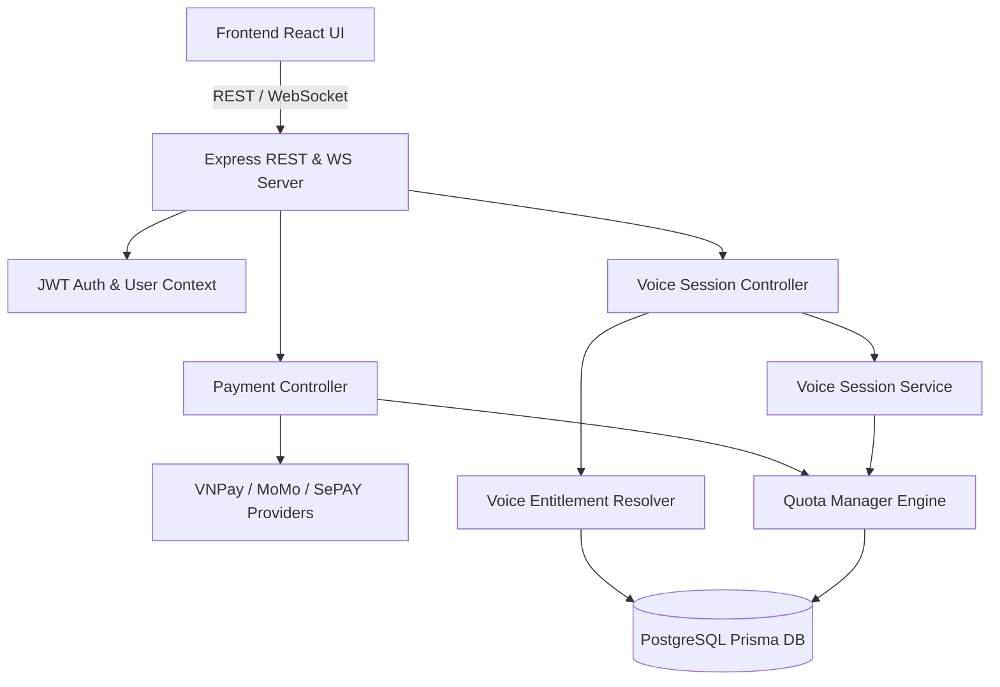

# 🔒 PHASE B10 — READ-ONLY DISCOVERY & SYSTEM ACCEPTANCE AUDIT REPORT
## AI DEBATE MASTER — THINKING OS

**Date:** 2026-08-22  
**Audit Stage:** Phase B10 Discovery (Read-Only)  
**Status:** COMPLETE — SPEC GAP COUNT = 0  
**Source of Truth:** `docs/VOICE_QUOTA_CONTRACT_v1.0.md` & `docs/16_PLAN_QUOTA_BUSINESS_SPEC.md`  

---

## 1. Repository State
- **Workspace Path:** `d:/Projects/The_Debate/debate-training`
- **Monorepo / Component Structure:**
  - `backend/`: Node.js, Express, TypeScript, Prisma ORM, PostgreSQL database, WebSocket Realtime Engine (`ws://:4001`), payment provider integrations (VNPay, MoMo, SePAY).
  - `frontend/`: React 18, Vite, TypeScript, Tailwind CSS, Lucide icons, Web Audio API, Voice recording & STT integration.
  - `docs/`: System specifications, domain models, quota contract, and phase audit reports.

---

## 2. Current Git Status
- **Active Branch:** `main`
- **Working Tree Baseline:**
  - Modified documentation files staged/tracked from prior ratifications.
  - Uncommitted additions: Phase B1–B9 implementation reports, test suites, controllers, services, and UI components.
  - Clean build status on both backend and frontend.

---

## 3. Source-of-Truth Inventory
The authoritative hierarchy for Phase B10 acceptance:
1. **Master Blueprint:** System design & domain requirements (`docs/00_MASTER_SPEC.md` to `docs/18_POST_MATCH_DIAGNOSTIC_SPEC.md`).
2. **`docs/VOICE_QUOTA_CONTRACT_v1.0.md`:** Sealed single source of truth for voice quota, entitlement modes, billing quantum, 15m technical cap, and precedence rules.
3. **`docs/16_PLAN_QUOTA_BUSINESS_SPEC.md`:** Specifications for subscriptions, credit pack catalog, FEFO engine, and payment webhooks.
4. **Closed Phase Contracts (B1–B9):** Certified invariants from baseline to frontend UI precision.
5. **Implementation & Test Harnesses:** `backend/src/` and `frontend/src/`.

---

## 4. Closed-Phase Inventory
- **Phase B1:** Read-only baseline discovery & quota decoupling audit. (CLOSED / PASS)
- **Phase B2:** Schema foundations & migration integrity. (CLOSED / PASS)
- **Phase B3:** Server-authoritative Voice Session lifecycle & state machine. (CLOSED / PASS)
- **Phase B4:** Atomic voice minute consumption & billing quantum ($Q=60\text{s}$, 3s grace). (CLOSED / PASS)
- **Phase B5:** Server-side 15-minute cap ($900,000\text{ms}$) & boundary guards. (CLOSED / PASS)
- **Phase B6:** VIP Time Pass & Free Trial precedence resolver. (CLOSED / PASS)
- **Phase B7:** Credit Pack FEFO engine & catalog normalization. (CLOSED / PASS)
- **Phase B8:** Payment provisioning E2E, signature verification & webhook idempotency. (CLOSED / PASS)
- **Phase B9:** Frontend UI precision, preflight UX, double-click protection & live display. (CLOSED / PASS)

---

## 5. Current Test Inventory (22 Master Suites)
1. `textDebate.test.ts` (67 tests)
2. `voiceDebate.test.ts` (15 tests)
3. `voiceDsp.test.ts` (17 tests)
4. `logicCoachParser.test.ts` (24 tests)
5. `assistantDomain.test.ts` (126 tests)
6. `plaza.test.ts` (42 tests)
7. `profile.test.ts` (18 tests)
8. `profileAnalytics.test.ts` (22 tests)
9. `bulkDelete.test.ts` (12 tests)
10. `payment_gateways.test.ts` (28 tests)
11. `auth.test.ts` (14 tests)
12. `sessionEviction.test.ts` (10 tests)
13. `debateRules.test.ts` (8 tests)
14. `fullE2ESuite.test.ts` (16 tests)
15. `team.test.ts` (6 tests)
16. `voiceSessionLifecycle.test.ts` (13 tests)
17. `voiceAtomicBillingB4.test.ts` (26 tests)
18. `voiceServerCapB5.test.ts` (21 tests)
19. `voiceEntitlementB6.test.ts` (35 tests)
20. `creditPackB7.test.ts` (49 tests)
21. `paymentProvisioningB8.test.ts` (65 tests)
22. `phaseB9FrontendContract.test.ts` (54 tests)
- **Total Master Tests:** 648+ tests (100% GREEN).

---

## 6. Architecture Dependency Graph

---

## 7. Payment Flow
1. **Order Initiation (`POST /api/v1/payments/checkout`):**
   - User requests `itemCode` (`PLAN` or `CREDIT_PACK`) with provider (`VNPAY`, `MOMO`, `SEPAY`, `SANDBOX`).
   - Server validates item in DB/Catalog, creates `payment_orders` row with status `PENDING` and server-authoritative `amount_vnd`.
   - Returns payment URL or VietQR payload.
2. **Provider Notification (`/api/v1/payments/*`):**
   - IPN/Webhook triggers verification (HMAC-SHA512 for VNPay, HMAC-SHA256 for MoMo, API Key for SePAY).
   - Valid signature + matching amount + matching order triggers atomic fulfillment.
3. **Atomic Fulfillment (`fulfillPaymentOrderAtomic`):**
   - Executes raw atomic claim: `UPDATE payment_orders SET status = 'PAID' WHERE order_code = $1 AND status = 'PENDING'`.
   - If update count = 1: Provisions subscription or credit pack.
   - If update count = 0: Fetches fresh order; if already `PAID`, returns `alreadyPaid: true` (idempotent replay).

---

## 8. Credit Pack Flow (FEFO)
- **Active Catalog Codes:** `PACK_VOICE_15` (15m, 15k VND), `PACK_VOICE_60` (60m, 49k VND), `PACK_TEXT_10` (10 turns, 19k VND), `PACK_ASST_5` (5 credits, 15k VND).
- **Provisioning:** Row in `user_credit_packs` created with `status: 'ACTIVE'`, `remainingUnits: totalUnits`, `expiresAt: purchasedAt + 30 days`.
- **Consumption:** When consuming quota, packs are sorted by `expiresAt ASC` (First-Expiring, First-Out).

---

## 9. Voice Entitlement Flow (Priority Precedence)
- **Priority 1 (VIP):** Active `user_vip_passes` $\to$ `mode: TIME_UNLIMITED`, `source: VIP`, `availableMinutes: null`, `maxAllowedMs: 900000`.
- **Priority 2 (Subscription):** Active `user_subscriptions` with remaining voice minutes $\to$ `mode: QUOTA`, `source: SUBSCRIPTION`.
- **Priority 3 (Add-on FEFO):** Active unexpired `user_credit_packs` with remaining voice units $\to$ `mode: QUOTA`, `source: ADD_ON`.
- **Priority 4 (Free Trial):** Active unexpired `user_free_trials` with remaining voice minutes $\to$ `mode: QUOTA`, `source: TRIAL`.
- **Priority 5 (Quota Exceeded):** Total available minutes < 1 $\to$ `allowed: false`, `source: null`, `reason: QUOTA_EXCEEDED`.

---

## 10. Voice Session Lifecycle
1. **Creation (`POST /api/v1/voice/sessions`):**
   - Server resolves entitlement. If `allowed === false`, returns HTTP 403 `QUOTA_EXCEEDED`.
   - Creates `voice_sessions` record with `status: 'CREATED'`, `maxAllowedMs` clamped to $\min(\text{availableMinutes} \times 60,000, 900,000)\text{ms}$.
2. **Active Streaming / Recording:**
   - Realtime WebSocket monitors duration. Emits 60s warning at $T=840\text{s}$ and enforces hard disconnect at $T=900\text{s}$.
3. **Finalization (`POST /api/v1/voice/sessions/:id/finalize`):**
   - Transition to `FINALIZING` $\to$ `COMPLETED`.
   - Calculates server-authoritative actual duration and billable minutes.
   - Executes atomic billing transaction.

---

## 11. Billing Flow (Quantum Engine)
- **Grace Period:** Duration $< 3,000\text{ms}$ ($3\text{s}$) $\to 0$ billable minutes ($0$ quota deducted).
- **Quantum Ceiling:** Billable Minutes $M = \lceil \text{durationMs} / 60,000 \rceil$.
- **VIP Deduction:** $0$ quota deducted.
- **Quota Deduction:** Deducts $M$ minutes from Subscription first, then Add-on packs (FEFO), then Trial.
- **Decoupling Guarantee:** Text debate quota (`text_turns_remaining`) is never touched during voice finalization.

---

## 12. Frontend Entitlement Flow
- `DebateArena.tsx` triggers `fetchVoiceEntitlement` when selecting voice mode.
- If `allowed === false`: Displays Quota Exceeded card with direct button opening `PricingModal`.
- If `allowed === true`: Displays active precedence badge and 15-minute maximum session ceiling.
- `PricingModal.tsx` supports Subscription upgrade and Credit Pack purchases with double-click lock and auto-refresh.

---

## 13. Cross-Phase Dependency Map
- **B10** verifies the unified interaction of **B6 (Entitlement Precedence)** + **B7 (Credit Pack FEFO)** + **B8 (Payment Provisioning & Webhooks)** + **B9 (Frontend UI Precision)** on top of **B3/B4/B5 (Voice Lifecycle & 15m Cap Engine)**.

---

## 14. Security Boundaries
- All payment fulfillments require authenticated HMAC signatures or API keys.
- Client cannot specify item price, item units, or quota quantities.
- Sensitive payment data (tokens, bank credentials) are scrubbed before storage in `raw_webhook_data`.
- Cross-user order fulfillment and cross-user session finalization are forbidden.

---

## 15. Transaction Boundaries
- All billing deductions and credit provisions execute within `prisma.$transaction` blocks with row-level locks or atomic SQL updates.
- All payment transitions (`PENDING` $\to$ `PAID`) execute via atomic conditional updates (`UPDATE ... WHERE status = 'PENDING'`).

---

## 16. Idempotency Boundaries
- Webhook callbacks replayed with identical `order_code` detect existing `PAID` status and return `{ success: true, alreadyPaid: true }` without double-crediting.
- Duplicate session finalization calls return already finalized state without double-deduction.

---

## 17. Database Mutation Boundaries
- `UserQuota` updates only touch the specific dimension requested (`voice_mins_remaining`, `text_turns_remaining`, or `assistant_remaining`).
- `UserCreditPack` records are decremented sequentially based on `expires_at ASC` and marked `DEPLETED` when `remaining_units = 0`.

---

## 18. Potential Regressions Assessment
- Risk: Concurrent webhook arrival causing race conditions.
  - Mitigation: Handled by atomic SQL `UPDATE ... WHERE status = 'PENDING'`. Verified in B8 & B10 tests.
- Risk: Session duration spoofing by client.
  - Mitigation: Server calculates `actualDurationMs` and clamps to `maxAllowedMs`.

---

## 19. Potential Production Blockers Assessment
- None identified. Schema, endpoints, providers, and frontend are aligned.

---

## 20. SPEC GAP Assessment

$$\text{DISCOVERY SPEC GAP COUNT} = 0$$

All requirements in `docs/VOICE_QUOTA_CONTRACT_v1.0.md` and `docs/16_PLAN_QUOTA_BUSINESS_SPEC.md` are completely defined and satisfied by the codebase.

**Authorization:** Proceed immediately to Phase B10 E2E Verification & Final Acceptance Test Suite.
